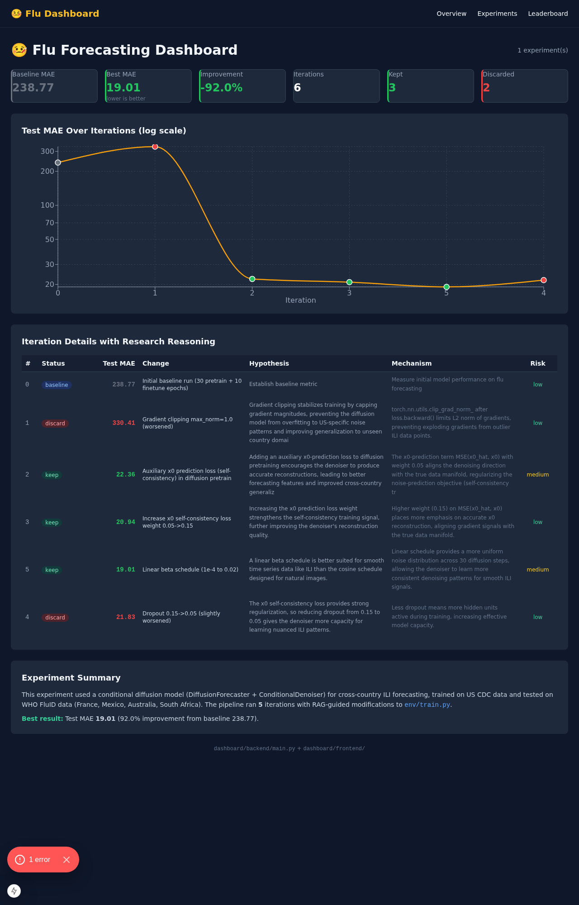

# MLSS26 Hackathon — Flu Forecasting AutoResearch

An autonomous **Scientific AI AutoResearch** system for cross-country ILI forecasting (flu), using diffusion models with RAG-augmented literature grounding.



## Quick Start

```bash
source .venv/bin/activate
python scripts/run_flu_pipeline.py --pretrain-epochs 30 --finetune-epochs 10
```

## RAG System (Flu)

- **Vector (FAISS)**: `index_output_flu/` — all-MiniLM-L6-v2 embeddings from 22 papers, 384-dim IVF
- **Graph (FalkorDB)**: Docker-backed knowledge graph with nodes `{Model, Dataset, Country, Metric, Method, Paper}` and relationships `{EVALUATED_ON, ACHIEVES, USES_METHOD, CITES, COMPARED_TO}`
- **Search**: `search_flu_context_rag(query, k=5)` → vector hits + graph context (keyword-matched Cypher, no LLM)

## Slash Commands

| Command | What it does |
|---------|-------------|
| `/autoresearch` | Simple modify → run → keep/discard against a single metric |
| `/autoresearch_final` | Full multi-expert pipeline with adaptive RAG + code jury + logging |
| `/autoresearch_pipeline` | Full multi-expert pipeline (alias for autoresearch_final) |

## Architecture

```
MLSS26_HACKATHON/
├── env/                           # Flu forecasting task
│   ├── data.py                    # CDC ILINet + WHO FluID loaders
│   ├── train.py                   # Diffusion forecasting model
│   └── eval.py                    # Evaluation metrics
├── MLAgentBench/agents/
│   ├── orchestrator.py            # ScientificAutoResearch + ExperimentManager
│   └── agent_specialized.py       # Agent prompts + RAG functions
├── scripts/
│   ├── run_flu_pipeline.py        # Flu CLI wrapper
│   ├── build_flu_graph.py         # FalkorDB knowledge graph builder
│   └── start_falkordb.sh          # FalkorDB Docker launcher
├── dashboard/                     # Interactive experiment dashboard
│   ├── backend/main.py            # FastAPI backend
│   └── frontend/                  # Next.js dashboard
├── index_output_flu/              # Flu FAISS index (MiniLM)
├── literature_flu/                # 22 flu forecasting PDFs
└── experiments/                   # Run logs and results
```

## Experiment Protocol

- Only modify `env/train.py`. Do NOT modify eval/data files.
- Run: `python scripts/run_flu_pipeline.py --pretrain-epochs 30 --finetune-epochs 10 > run.log 2>&1`
- Parse `grep "Test MAE" run.log | awk '{print $NF}'`
- Log to `experiments/loop-flu-{YYMMDD}-{HHMM}/results.tsv`
