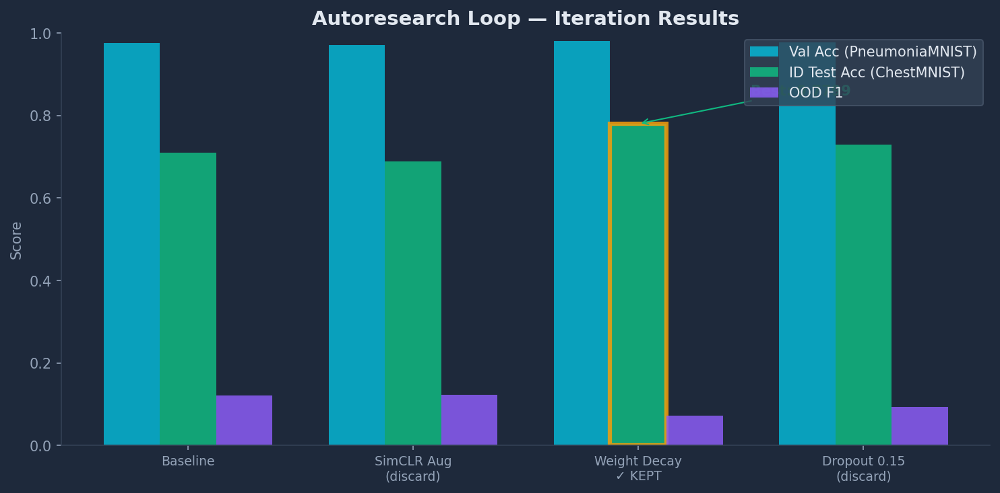
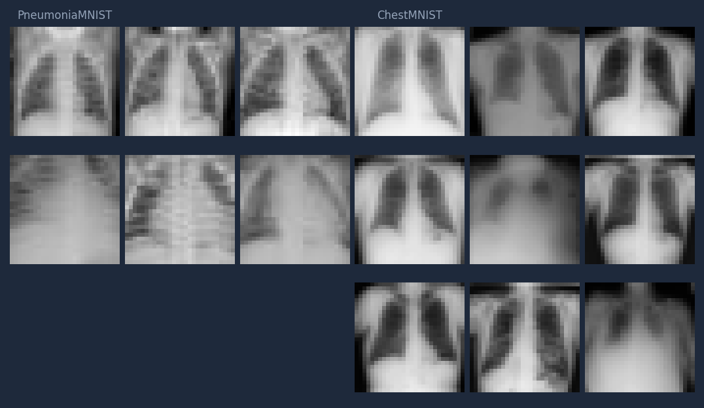

# MLSS26 Hackathon — Scientific AI AutoResearch (Multi-Task)

An autonomous **Scientific AI AutoResearch** system supporting multiple ML tasks. Each task has its own training script, metrics, and environment — all share the same 8-agent pipeline, code jury, and keep/discard loop.

## Available Tasks

| Task | Domain | Runner | Primary Metric | Best Result |
|------|--------|--------|----------------|-------------|
| **medmnist** | Chest X-ray OOD detection | `scripts/run_medmnist.py` | OOD F1 / ID Test Acc | OOD F1: 0.3234 |
| **flu** | ILI forecasting (CDC + WHO) | `scripts/run_exp.py` | Test MAE | 0.802 (baseline) |

Pass `Task: medmnist` or `Task: flu` when invoking `/autoresearch_pipeline`.

---

## Baseline Model

The baseline is a **2-layer `SimpleCNN`** defined in `train.py`:

| Component | Detail |
|-----------|--------|
| **Architecture** | Conv2d(1→32) → BN → LeakyReLU → MaxPool → Conv2d(32→64) → BN → LeakyReLU → MaxPool → FC(3136→128) → FC(128→3) |
| **Params** | ~415K |
| **Optimizer** | Adam, lr=1e-3 |
| **Epochs** | 20 |
| **Batch size** | 64 |
| **OOD method** | Softmax confidence threshold (τ=0.7) — max prob < 0.7 → predict OOD (class 2) |
| **Loss** | Cross-entropy (2-class on PneumoniaMNIST) |

**Baseline results** (train_backup.py): ID Test Acc ≈ **71%**, OOD F1 ≈ **0.12**.

A frozen copy of the baseline is saved at `MLAgentBench/benchmarks/medmnist/env/train_backup.py` — it is never modified, and all experiment iterations are compared against it.

---

## Task: Chest X-ray OOD Detection

| | |
|---|---|
| **Train** | PneumoniaMNIST (4,708 samples, 28×28) |
| **Classes** | normal, pneumonia |
| **Test** | ChestMNIST 3-class subset (600 samples) |
| **Classes** | normal (300), pneumonia (59), **consolidation 🆕 OOD** (241) |
| **Goal** | Maximize OOD F1 + ID test accuracy |
| **Baseline** | ID Test Acc: 71%, OOD F1: 0.12 |

The scientific challenge: a model trained only on PneumoniaMNIST must:
1. Correctly classify normal vs pneumonia from ChestMNIST (domain transfer)
2. Detect consolidation as **OOD** despite looking nearly identical to pneumonia on X-rays

## Sample Run Results



The plot shows a typical autoresearch run: weight decay (iteration 2) improved ID Test Acc from 71% to 78% (+9.8%). Discarded changes are shown in red, kept in green.

## Dataset Samples



The model trains on **PneumoniaMNIST** (28×28 grayscale chest X-rays, 2 classes: normal, pneumonia) and is evaluated on **ChestMNIST** (same resolution, 3 classes: normal, pneumonia, **consolidation** as an unseen OOD class). The 6 columns show 3 training samples per class from PneumoniaMNIST (left) and 3 test samples per class from ChestMNIST (right). Notice the visual similarity between pneumonia and consolidation — this is the key OOD detection challenge.

---

## Architecture

```
User / Dashboard
       |
       v
+------------------------------+
|    Scientific AutoResearch   |
|    Orchestrator              |  ← modify → train → eval → keep/discard
+------------------------------+
       |         ↑
       |         | consultation (route_to_agent)
       v         |
+------------------------------+
|    8 Specialized Agents     |  ← domain experts with RAG
+------------------------------+
        |         ↕
        |         +---------------------------+
        |         |  Literature RAG (task)    |
        |         |  medmnist: index_output/  |
        |         |  flu:      index_output_flu/ |
        |         +---------------------------+
        v
+------------------------------+
|   Experiment Pipeline       |  ← scripts/run_medmnist.py (medmnist)
|                              |  ← scripts/run_exp.py (flu)
+------------------------------+
```

Agents call `search_medical_literature(query, k=5, task="{TASK}")` to retrieve relevant papers before proposing changes. The medmnist index (`index_output/`) contains 525 visual tile embeddings from 28 medical papers on OOD detection and chest X-rays, embedded with Qwen3-VL-Embedding-2B. The flu index (`index_output_flu/`) contains 475 text chunks from 22 papers on forecasting and diffusion models, embedded with all-MiniLM-L6-v2.

---

## Local Expert LLMs (GPU 1)

When the pipeline consults an expert, it loads a local model on **GPU 1** (reserved for inference, 98GB VRAM) with the agent's system prompt:

| Agent | Model | Size | Path |
|-------|-------|------|------|
| **CV Expert** | Med-R1 (Qwen2.5-VL-3B) | 7.1GB | `models/Qwen_2.5_3B_nothink/` |
| **Code/DL Expert** | Qwen2.5-Coder-7B | 15GB | `models/Qwen2.5-Coder-7B-Instruct/` |
| **Math/Stats Expert** | Qwen2.5-Math-7B | 15GB | `models/Qwen2.5-Math-7B-Instruct/` |
| **Medical Expert** | BioMistral-7B | 14GB | `models/BioMistral-7B/` |
| **AutoResearch** | *(AI assistant)* | — | — |
| **Research Literature** | RAG index (FAISS) | — | `index_output/` or `index_output_flu/` |

**Total VRAM**: ~51GB / 98GB. Models load on demand via `orchestrator.consult_agent(role, question)` and stay cached across consultations.

## 8 Specialized Agents

Each agent has a role-specific system prompt with integrated domain skills. Defined in `MLAgentBench/agents/agent_specialized.py`.

| Agent | Role | Skill Integration | RAG Access |
|-------|------|-------------------|------------|
| **CV Expert** | CNN architecture, augmentation, OOD scoring | Computer Vision skill | ✅ Yes |
| **DL Expert** | Loss functions, optimizers, calibration | Deep Learning skill | ✅ Yes |
| **Medical Expert** | Chest X-ray, MedMNIST, pneumonia patterns | Imaging Algorithms skill | ✅ Yes |
| **Robustness Expert** | OOD theory, uncertainty, confidence calibration | Imaging Algorithms skill | ✅ Yes |
| **Research Literature** | Paper search, SOTA methods | Literature RAG tool | ✅ Yes |
| **AutoResearch** | Experiment planning, iteration strategy | Autoresearch loop skill | ✅ Yes |
| **LLM Expert** | Multi-agent coordination, prompt design | — | ✅ Yes |
| **Continual Learning** | Anti-forgetting, checkpoint versioning, EWC | — | ✅ Yes |

Agents are routed via the orchestrator based on the goal keywords. For example, if your goal mentions "ood" or "threshold", the orchestrator routes to `robustness_expert`. If it mentions "architecture" or "augment", it routes to `cv_expert`.

Run `/autoresearch_pipeline` for a **multi-expert workflow** that cycles through all 8 agents in sequence per iteration: research_literature + medical_expert (research phase) → llm_expert + autoresearch (plan phase) → cv_expert or dl_expert (implementation phase) → robustness_expert + continual_learning (review phase). This ensures every change is researched, planned, coded, and validated by the right expert.

---

## 14 AutoResearch Slash Commands

Available as opencode commands (type `/` in the TUI). Defined in `.opencode/commands/autoresearch_*.md`. Each command asks setup questions — **RAG** (search medical literature) and/or **Pretrained** (finetune pretrained models).

| Command | Purpose | RAG | Pretrained |
|---------|---------|-----|-----------|
| `/autoresearch` | Iterate against metric: modify → verify → keep/discard | Q3 | Q3 |
| `/autoresearch_plan` | Convert goal into experiment config | Q3 | — |
| `/autoresearch_debug` | Hunt bugs via hypothesis testing | Q4 | — |
| `/autoresearch_fix` | Fix errors one-by-one to zero | Q3 | — |
| `/autoresearch_scenario` | Explore edge cases and sensitivity | Q3 | — |
| `/autoresearch_predict` | 5-expert debate before changing code | Q2 | — |
| `/autoresearch_learn` | Extract cross-iteration lessons | Q2 | — |
| `/autoresearch_reason` | Adversarial debate with blind judges | Q2 | — |
| `/autoresearch_probe` | Surface hidden constraints | Q2 | — |
| `/autoresearch_improve` | Research SOTA methods, generate PRDs | Q3 | — |
| `/autoresearch_evals` | Analyze trends across all runs | Q1 | — |
| `/autoresearch_regression` | Baseline vs candidate stability gate | Q3 | — |
| `/autoresearch_scientific` | 🧪 Full loop + 8 specialized agents | Q4 | Q5 |
| `/autoresearch_pipeline` | 🔄 Multi-expert pipeline: 8 agents + code jury per iteration — research → plan → code → jury → review → commit → run → decide → log. Supports `Task: medmnist` or `Task: flu` | Q3 | Q4 |

---

## Dashboard Features

The dashboard (FastAPI backend + Next.js frontend) provides real-time experiment monitoring:

| Page | Route | What It Shows |
|------|-------|---------------|
| **Overview** | `/` | Val Acc / ID Test Acc / OOD F1 timeline, recent runs, auto-loop cards |
| **Experiments** | `/experiments` | Filterable table with source badges, search, keeep/discard tracking |
| **Experiment Detail** | `/experiments/[id]` | 3-metric line chart, iteration log with deltas, **PCA embeddings** (test vs val), per-class accuracy bars, OOD confusion matrix, sample images per class |
| **Agents** | `/agents` | 8 agent cards with model configs and skills |
| **Config** | `/config` | Live agent-to-model reassignment via dropdowns |
| **Leaderboard** | `/leaderboard` | Ranked by best ID Test Acc / OOD F1 |

The experiment detail page includes a **PCA embedding scatter plot** showing both PneumoniaMNIST (val, diamonds) and ChestMNIST (test, circles) samples projected into 2D feature space — useful for visualizing domain shift.

---

## Skills

Integrated domain skills (loaded from the skill system) give agents specialized knowledge:

- **Computer Vision** — OpenCV, scikit-image, torchvision operations for image preprocessing, feature detection, thresholding
- **Deep Learning** — PyTorch training patterns, loss functions (Cross-Entropy, Focal, label smoothing), optimizer config (AdamW, SGD), scheduling (cosine annealing, warmup)
- **Imaging Algorithms** — Classification metrics (Accuracy, F1, AUROC), OOD metrics (FPR@95, ECE), image preprocessing (normalization, CLAHE, denoising)
- **Autoresearch Loop** — Karpathy-style autonomous experiment loop: baseline → modify → verify → keep/discard

## Quick Start

### 1. Setup
```bash
source .venv/bin/activate
export OPENROUTER_API_KEY=sk-or-v1-...
```

### 2. Run baseline experiment
```bash
python scripts/run_medmnist.py --epochs 20
```

### 3. Run the autonomy loop
```bash
python -m MLAgentBench.agents.orchestrator \
    --agent autoresearch \
    --iterations 25 \
    --verify "python scripts/run_medmnist.py --epochs 20"
```

### 4. Start dashboard
```bash
scripts/start_dashboard.sh
# → Backend: http://localhost:8000
# → Frontend: http://localhost:3000
```

---

## Data

| Dataset | Source | Samples | Role |
|---------|--------|---------|------|
| **PneumoniaMNIST** | MedMNIST (auto-download) | 4,708 train + 524 val | Training |
| **ChestMNIST subset** | Extracted from MedMNIST | 600 test | Evaluation |
| Path: `data/medmnist_subset/chestmnist_3class.npz` (432 KB) | | | |

---

## Project Structure

```
MLSS26_HACKATHON/
├── AGENTS.md
├── README.md
├── program.md
├── .opencode/skills/autoresearch/SKILL.md     # 15 subcommands
├── env/                                          # 🆕 Flu forecasting task
│   ├── data.py                                   # CDC + WHO data loaders
│   ├── train.py                                  # Forecasting models (LSTM, GRU, TCN, Transformer)
│   └── eval.py                                   # Evaluation metrics
├── configs/agents.yaml                           # Agents config
├── configs/models.yaml                         # OpenRouter models
├── MLAgentBench/agents/
│   ├── orchestrator.py                         # Unified loop
│   ├── agent_specialized.py                    # 8 agents
│   └── continual_learning.py
├── MLAgentBench/benchmarks/medmnist/           # 🆕 Current task
│   ├── env/train.py                            # Training script
│   └── env/loader.py                           # Data loader
├── data/medmnist_subset/                       # ChestMNIST 3-class subset
├── scripts/
│   ├── run_medmnist.py                           # MedMNIST experiment CLI
│   ├── run_exp.py                                # 🆕 Flu forecasting CLI
│   ├── run_flu_pipeline.py                       # 🆕 Full flu pipeline
│   └── run_autoresearch_scientific.sh            # Scientific AI launcher
├── experiments/                                # Results
├── dashboard/
│   ├── backend/ (FastAPI)
│   └── frontend/ (Next.js)
├── models/
│   ├── Qwen3-VL-Embedding-2B/                  # Visual RAG embedding model (2.1B)
│   └── Qwen3-VL-Embedding-LoRA/                # LoRA adapters (lora_vit, dora_ls005, hyper3)
└── .venv/
```

---

## Literature RAG (Task-Aware)

Each task has its own FAISS index for retrieving relevant papers during the research phase.

| Task | Papers | Index | Embedding Model | Chunks |
|------|--------|-------|-----------------|--------|
| **medmnist** | 28 medical (PDF) | `index_output/` | Qwen3-VL-Embedding-2B (2.1B, vision) | 525 tiles |
| **flu** | 22 forecasting (PDF) | `index_output_flu/` | all-MiniLM-L6-v2 (text) | 475 chunks |

The pipeline automatically selects the correct index based on `Task: medmnist` or `Task: flu`:

```python
# Called in Phase 1 (Research) of the pipeline:
search_medical_literature(query, k=5, task="medmnist")  # → index_output/
search_medical_literature(query, k=5, task="flu")        # → index_output_flu/
```

### medmnist RAG (Visual)
Rendered PDF tiles embedded with Qwen3-VL-Embedding-2B (vision-language). Best for understanding medical images, OOD detection, and chest X-ray patterns.

### flu RAG (Text)
Text chunks from 22 papers on diffusion models, Neural ODEs, epidemiology, time series forecasting, and physics-informed methods. Embedded with sentence-transformers (MiniLM). Built via:

```bash
python scripts/build_flu_rag.py
```

## Dashboard

| Page | Route | Feature |
|------|-------|---------|
| Overview | `/` | Score chart, experiment stats |
| Experiments | `/experiments` | List with source badges |
| Experiment Detail | `/experiments/[id]` | Score + agent log, PCA embeddings, per-class accuracy |
| Agents | `/agents` | Status and models |
| Config | `/config` | Model swap panel |
| Leaderboard | `/leaderboard` | Ranked by OOD F1 |

---

## License

MIT — inherited from [MLAgentBench](https://github.com/snap-stanford/MLAgentBench).
